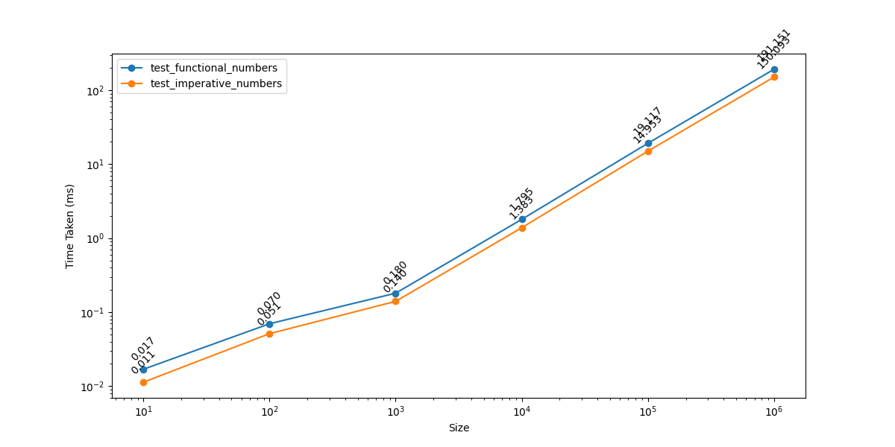
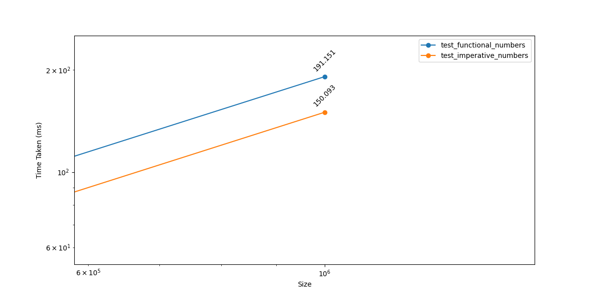
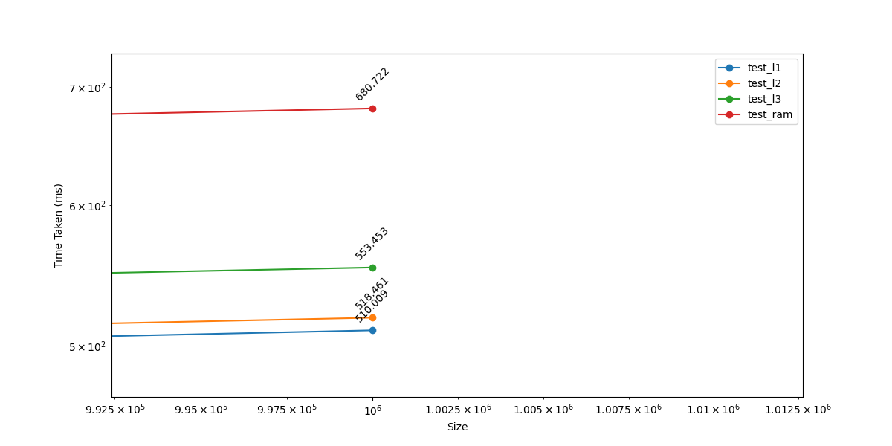
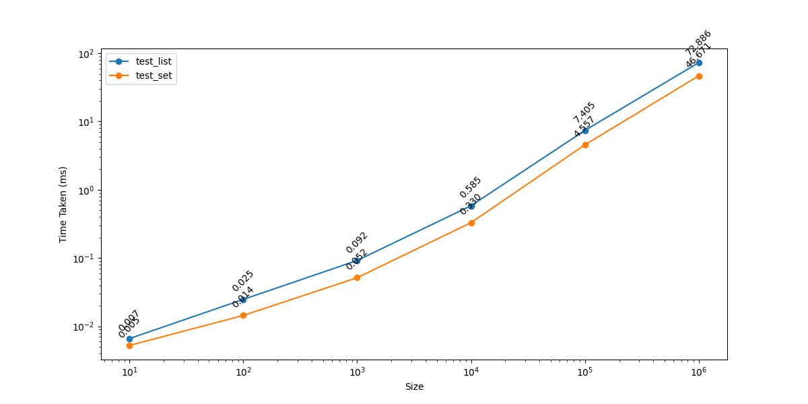
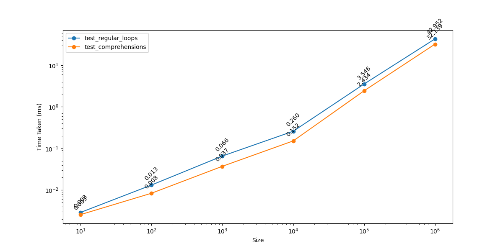
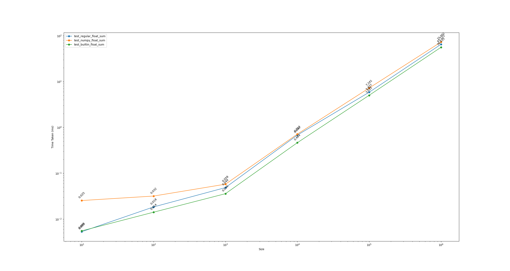
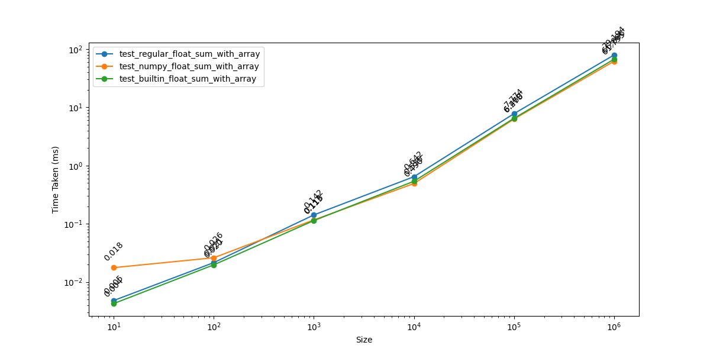
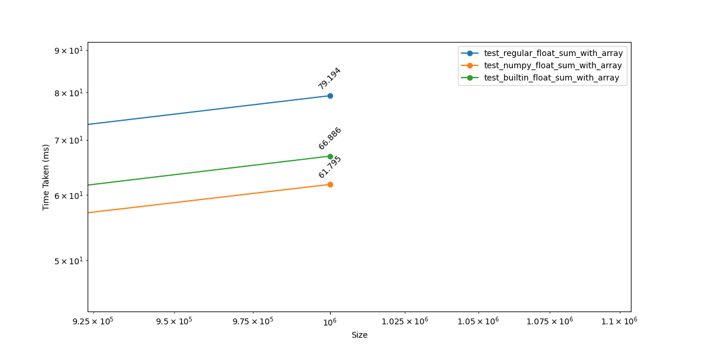

# Optimizing Python for fun and for profit

Did you know so much software that we use day to day can run so much [faster](https://www.youtube.com/watch?v=hxM8QmyZXtg) than it already does. Like I'm talking at times 1000X faster! I didn't but learning from the likes of [Casey Muratori](https://www.youtube.com/watch?v=tD5NrevFtbU), it blew my mind how frequent this happens and how little we think about it in the industry. We moved from compiled languages to interpreted because they're supposedly easier, but we chose to throw the baby out with the bath water. The way we write code, in our already slower interpreted languages, slows things down even further!

If you haven't already seen it yet, check out romgrk's [Optimizing Javascript for fun and for profit](https://romgrk.com/posts/optimizing-javascript) post. It's excellent and delves into some of the intricacies of Javascript and performance in general. Why don't we do the same for Python?

## How did we measure performance in this article?
Benchmarking is tricky as romgrk points out. We use the processors clock cycles (the processors internal "tick") and measure how many cycles our processor counts per second. From there we profile sections by their cycles. Shoutout to Paul Smith's [hwcounter](https://github.com/paulsmith/hwcounter) package for this. Why did we use hwcounter and not the recommended built in time lib perf_counter_ns function? So we can see the cycle count of certain sections and start to think about how fast we could theoretically go, and how far we are from that. I'll explain this more later in the artcle. From what I saw, they're time measurement is almost identical.

For each section, we tried various sizes or iterations: 10, 100, 1000, ... 1 million. We also did about 30 runs for each size, per test in the section, to weed out any possible anomolies. Finally, we reran the whole set multiple times and on two different machines/operating systems in order to further reduce possible external effects. Its probably still not enough, ideally we randomize our memory layout as discussed in [Emery Berger's Coz Profiler talk](https://www.youtube.com/watch?v=r-TLSBdHe1A), however I didn't know how to do that so this is as close as I got.


## 0. Avoid work

romgrk doesn't provide a specifc code example for this one, but since this is one of the most important points in this article, I figure I should.

```python
def get_users_with_payment_info():
    # Simulate fetching users with payment info
    users = [
        {"id": 1, "name": "Alice", "email": "alice@example.com"},
        {"id": 2, "name": "Bob", "email": "bob@example.com"},
        # ...
    ]

    payment_info = {
        1: {"credit_card": "**** **** **** 1234", "balance": 50.00},
        2: {"credit_card": "**** **** **** 5678", "balance": 100.00},
        # ...
    }

    for user in users:
        user["payment_info"] = payment_info[user["id"]]

    return users

def process_payments():
    print("Processing payments...")
    users = get_users_with_payment_info()
    for user in users:
        print(f"Processing payment for {user['name']} with card {user['payment_info']['credit_card']}")

def send_newsletters():
    print("Sending newsletters...")
    users = get_users()
    for user in users:
        print(f"Sending newsletter to {user['email']}")

process_payments()
send_newsletters()
```

In case you didn't catch it, the `send_newsletters` function doesn't need the user payment info. We've all been here. We think, "Oh I'll reuse my function, I don't have to write more code!". Excuses might be, "Well even if it does more work, its not much. We can afford the small hit.", but keep in mind these small inefficiencies stack up giving our end users a worse experience.

See [here](https://youtu.be/fHNmRkzxHWs?t=1431) for another example. I highly recommend the full talk.


## 1. String comparison

```python
def test_compare_string(iterations):
    position_str = {
        'TOP': 'TOP',
        'BOTTOM': 'BOTTOM'
    }
    _ = 0
    for i in range(iterations):
        current = position_str['TOP'] if i % 2 == 0 else position_str['BOTTOM']
        if current == position_str['TOP']:
            _ += 1
            
def test_compare_int(iterations):
    position_int = {
        'TOP': 0,
        'BOTTOM': 1
    }

    _ = 0
    for i in range(iterations):
        current = position_int['TOP'] if i % 2 == 0 else position_int['BOTTOM']
        if current == position_int['TOP']:
            _ += 1

def test_compare_float(iterations):
    position_int = {
        'TOP': 0.0,
        'BOTTOM': 1.0
    }

    _ = 0
    for i in range(iterations):
        current = position_int['TOP'] if i % 2 == 0 else position_int['BOTTOM']
        if current == position_int['TOP']:
            _ += 1
            
def test_compare_string_long(iterations):
    position_str = {
        'TOP': 'TOP' * 1000,
        'BOTTOM': 'TOP' * 1000 + 'B'
    }
    _ = 0
    for i in range(iterations):
        current = position_str['TOP'] if i % 2 == 0 else position_str['BOTTOM']
        if current == position_str['TOP']:
            _ += 1
```

I included two more tests here, a float comparison and a long string comparison. The results were surprising. There wasn't a stark performance difference between tests and I saw varied results at different sizes. Even the long string comparison performed at times better that the short string or the float. 

**Conclusion:** inconclusive / not meaningful.


## 2. Different shapes

```python
def add(a1, b1):
  return a1["a"] + a1["b"] + a1["c"] + a1["d"] + a1["e"] + b1["a"] + b1["b"] + b1["c"] + b1["d"] + b1["e"]

def test_shape_monomorphic(iterations):
    _ = 0
    o1 = { "a": 1, "b": 0, "c": 0, "d": 0, "e": 0 }
    o2 = { "a": 1, "b": 0, "c": 0, "d": 0, "e": 0 }
    o3 = { "a": 1, "b": 0, "c": 0, "d": 0, "e": 0 }
    o4 = { "a": 1, "b": 0, "c": 0, "d": 0, "e": 0 }
    o5 = { "a": 1, "b": 0, "c": 0, "d": 0, "e": 0 } # all shapes are equal
    
    result = 0
    for i in range(iterations):
        result += add(o1, o2)
        result += add(o3, o4)
        result += add(o4, o5)
    return result

def test_shape_polymorphic(iterations):
    _ = 0
    o1 = { "a": 1, "b": 0, "c": 0, "d": 0, "e": 0 }
    o2 = { "a": 1, "b": 0, "c": 0, "d": 0, "e": 0 }
    o3 = { "a": 1, "b": 0, "c": 0, "d": 0, "e": 0 }
    o4 = { "a": 1, "b": 0, "c": 0, "d": 0, "e": 0 }
    o5 = { "b": 0, "a": 1, "c": 0, "d": 0, "e": 0 } # this shape is different
    
    result = 0
    for i in range(iterations):
        result += add(o1, o2)
        result += add(o3, o4)
        result += add(o4, o5)
    return result
    
def test_shape_megamorphic(iterations):
    o1 = { "a": 1, "b": 0, "c": 0, "d": 0, "e": 0 }
    o2 = { "b": 0, "a": 1, "c": 0, "d": 0, "e": 0 }
    o3 = { "b": 0, "c": 0, "a": 1, "d": 0, "e": 0 }
    o4 = { "b": 0, "c": 0, "d": 0, "a": 1, "e": 0 }
    o5 = { "b": 0, "c": 0, "d": 0, "e": 0, "a": 1 } # all shapes are different

    result = 0
    for i in range(iterations):
        result += add(o1, o2)
        result += add(o3, o4)
        result += add(o4, o5)
    return result
```

The Python interpreter doesn't have an internal concept of a _shape_ like Javascript engines do, so its no surprise that the results here weren't meaningful either. Key takeaway here is that languages are different and applying the same optimizations across them does not yield the same results.


## 3. Functional methods

```python
import random
from functools import reduce

def get_numbers(size):
    numbers = []
    for i in range(0, size):
        numbers.append(random.random())
    
    return numbers

def acc_add(a, x):
    return a + x

def test_functional_numbers(size):
    return reduce(acc_add, filter(lambda x: x % 2 == 0, map(lambda x: round(x * 10), get_numbers(size))))

def test_imperative_numbers(size):
    result = 0
    for i in get_numbers(size):
        n = round(i * 10)
        if n % 2 == 0:
            continue
        result += n
    return result
```

I've heard from various people that functional methods in interpreted languages are optimized. Well, accorrding to romgrk's and these tests, thats just not the case for Javascript and Python.


Zooming in


However, there are a lot of these functions stacked on top of each other, what if we simplified the test?

```python
## Just map
def test_functional_numbers(size):
    return list(map(lambda x: round(x * 10), get_numbers(size)))

def test_imperative_numbers(size):
    result = []
    for i in get_numbers(size):
        result.append(round(i * 10))
    return result
```

```python
## Just map + filter
def test_functional_numbers(size):
    return list(map(lambda x: round(x * 10), get_numbers(size)))

def test_imperative_numbers(size):
    result = []
    for i in get_numbers(size):
        result.append(round(i * 10))
    return result
```

For the just map result, most runs showed a marginal improvement in the _functional_ case but weren't statistically significant. However map + filter was starting to show decline in performance compared to the iterative approach with larger sizes.

**Conclusion:** for a large number of iterations, avoid stacking these functional methods


## 4. Indirection

```python
class Proxy:
    def __init__(self, obj):
        self._obj = obj
    
    def __getattr__(self, name):    
        return self._obj[name]
    
    def __getitem__(self, name):
        return self._obj[name]

def test_class_access_getattr(iterations):
    point = Proxy({'x': 10, 'y': 20})

    total = 0
    for i in range(iterations):
        total += point.x

def test_class_access_getitem(iterations):
    point = Proxy({'x': 10, 'y': 20})

    total = 0
    for i in range(iterations):
        total += point["x"]

def test_map_access(iterations):
    point = {'x': 10, 'y': 20}

    total = 0
    for i in range(iterations):
        total += point["x"]
        
def test_direct_access(iterations):
    point = {'x': 10, 'y': 20}
    x = point['x']

    total = 0
    for i in range(iterations):
        total += x
```

Here we tried using getitem and getattr for accessing class based attributes, but the results are stark. At 1 million iterations, standard attribute access was 10X slower than direct access!

**Conclusion:** [Avoid indirection / map accesses](https://youtu.be/fHNmRkzxHWs?t=1431).


## 5. Cache misses

### Prefetching

```python
import random

def init(size):
    points = [{'x': 42, 'y': 0} for _ in range(size)]

    shuffled_points = points[:]
    random.shuffle(shuffled_points)
    
    return points, shuffled_points

def test_sequential_access(size):
    points, shuffled_points = init(size)
    
    _ = 0
    for point in points:
        _ += point['x']

def test_random_access(size):
    points, shuffled_points = init(size)
    
    _ = 0
    for point in shuffled_points:
        _ += point['x']
```

Results here were the same as romgrk's case, with large iterations sometimes being 100ms slower in the random access case!

**Conclusion:** Favour sequential over random access.

### Caching in L1/2/3

```python
import numpy as np
import random

# These are approximate sizes to fit in those caches. If you don't get the
# same results on your machine, it might be because your sizes differ.

L1 = 256 * 1000 # 544KiB L1 on my machine
L2 = 2 * 1000 * 1000 # 11.5 MiB on my machine 
L3 = 14 * 1000 * 1000 # 24 MiB on my machine
RAM = 5 * 1000 * 1000 * 1000 # 32 GiB on my machine

# We'll be accessing the same buffer for all test cases, but we'll
# only be accessing the first 0 to `L1` entries in the first case,
# 0 to `L2` in the second, etc.
buffer = np.full(RAM, 42, dtype=np.int8)

# Function to generate a random index
def get_random(max_value):
    return random.randint(0, max_value - 1)

def test_l1(iterations):
    r = 0
    for _ in range(iterations):
        r += buffer[get_random(L1)]

def test_l2(iterations):
    r = 0
    for _ in range(iterations):
        r += buffer[get_random(L2)]

def test_l3(iterations):
    r = 0
    for _ in range(iterations):
        r += buffer[get_random(L3)]

def test_ram(iterations):
    r = 0
    for _ in range(iterations):
        r += buffer[get_random(RAM)]
```

Once again, the results are stark.



**Conclusion:** Optimizing memory locality, both spatial and temporal, is essential for performance. Spatial meaning keeping the data you're processing small enough to fit within the cache. Temporal meaning ideally completing operations on it before switching to other data which helps avoid frequent cache evictions, where data continually displaces each other.

## 6. Large objects

```python
def get_large_obj(size):
    
    by_id = {id: {'id': id, 'name': 'John'} for id in range(size)}
    
    return by_id

def test_large_obj_indirect(size):
    _ = 0

    by_id = get_large_obj(size)
    
    for id in by_id:
        _ += by_id[id]['id']

def test_large_obj_direct(size):
    _ = 0
    
    by_id = get_large_obj(size)
    
    for user in by_id.values():
        _ += user['id']
```

Large object indirect access is slower. Findings were noticeable in 10_000, 100_000, and 1_000_000 sizes.


## 7. Eval

```python
key = 'requestId'

def get_values(size):
    values = [42] * 100000
    
    return values

def test_without_eval(size):
    messages = []
    
    for value in get_values(size):
        messages.append({key: value})
    return messages

def test_with_eval(size):
    messages = []
    for value in get_values(size):
        message = eval(f'{{"{key}": {value}}}')
        messages.append(message)
    return messages
```

Unlike the Javascript case, there is no optimization here for this, dont do this, its far slower.

## 8. Strings

```python
class_names = ['primary', 'selected', 'active', 'medium']

# 1. mutation
def test_string_mutation(size):
    for i in range(size):
        ' '.join(map(lambda c: f'button--{c}', class_names))

# 2. concatenation
def test_string_concatenation(size):
    for i in range(size):
        ' '.join(map(lambda c: ' button--' + c, class_names))
```

Practically no noticeable results here.

## 9. Specialization

```python
descriptions = ['apples', 'oranges', 'bananas', 'seven']
some_tags = {
    'apples': '::promotion::',
}
no_tags = {}

def is_empty(o):
    return len(o) == 0

def products_to_string(description, tags):
    result = ''
    for product in description:
        result += product
        if product in tags:
            result += tags[product]
        result += ', '
    return result

def products_to_string_specialized(description, tags):
    if is_empty(tags):
        result = ''
        for product in description:
            result += product + ', '
        return result
    else:
        result = ''
        for product in description:
            result += product
            if product in tags:
                result += tags[product]
            result += ', '
        return result

def test_not_specialized(size):
    for _ in range(size):
        products_to_string(descriptions, some_tags)
        products_to_string(descriptions, no_tags)

def test_specialized(size):
    for _ in range(size):
        products_to_string_specialized(descriptions, some_tags)
        products_to_string_specialized(descriptions, no_tags)
```

My results here ran completely condradictory to romgrk's. Specialization here ran slower for each iteration size, with 1_000_000 size showing almost a 100ms slowdown!

**Conclusion:** Be wary of optimizations like these and benchmark!

## 10. Data structures

```python
def init(size):
    user_ids = list(range(size))
    admin_ids_list = user_ids[:10]
    admin_ids_set = set(admin_ids_list)
    
    return user_ids, admin_ids_list, admin_ids_set

def test_list(size):
    user_ids, admin_ids_list, admin_ids_set = init(size)
    
    _ = 0
    for i in range(len(user_ids)):
        if user_ids[i] in admin_ids_list:
            _ += 1

def test_set(size):
    user_ids, admin_ids_list, admin_ids_set = init(size)
    
    _ = 0
    for i in range(len(user_ids)):
        if user_ids[i] in admin_ids_set:
            _ += 1

```



**Conclusion:** The results speak for themselves. Use appropriate data structures!


## Lets get specific
Here and the next few sections, we'll get into more cases that are specific to Python and try to get deeper into performance and how things work

## 11. List comprehensions

```python
def test_comprehensions(size):
    result = [i for i in range(size)]
    
    return result

def test_regular_loops(size):
    result = []
    for i in range(size):
        result.append(i)
    
    return result
```



**Conclusion:** List comprehensions are faster, at least for simple cases like these

## 12. Float vs Int

```python
def test_float_arithmetic(size):
    s = 1.0
    buffer = [float(i) for i in range(size)]
    for i in buffer:
        s += i

def test_int_arithmetic(size):
    s = 1
    buffer = [int(i) for i in range(size)]
    for i in buffer:
        s += i
```
See the first comment [here](https://www.reddit.com/r/Python/comments/ddootj/float_arithmetics_as_fast_or_even_faster_than_int/).

**Conclusion:** Things start to become noticeable at high iterations. Operating on floats is faster.


## 12. Libraries using C/Fortran

Let's build on our previous example and introduce some libraries that use C or Fortran under the hood. I've also introduced the built in `sum` function.

```python
import numpy as np

def test_regular_float_sum(size):
    s = 1.0
    buffer = [float(i) for i in range(size)]
    for i in buffer:
        s += i

def test_numpy_float_sum(size):
    s = 1.0
    buffer = [float(i) for i in range(size)]
    s += np.sum(buffer, dtype=np.float64)

def test_builtin_float_sum(size):
    s = 1.0
    buffer = [float(i) for i in range(size)]
    s += sum(buffer)
```



The image may be a bit hard to see but the numpy sum is in the orange, its slower than the regular sum! I thought perhaps this may be because I was running all the tests simultaneously and something external might have effected the results, but running things independently showed the same. The built in version proved the fastest. So how come a library supposedly using C under the hood is so slow?

So I did a bit of cheating here, my apologies. I already know what's going on here because of Casey Muratori's [Performance Aware Programming](https://www.computerenhance.com/p/table-of-contents) course. If you haven't already done so, please go check it out. It really dives deep into performance aware programming and I highly recommend it to really open your mind about what's possible.

Python does a lot of work to figure out what type is what. I thought perhaps passing the `dtype` would be enought for numpy but unfortunately thats not the case. However, using the `array` module with their data type specifiers _does_ have an effect.

```python
import numpy as np
import array

def test_regular_float_sum_with_array(size):
    s = 1.0
    buffer = array.array('d', [float(i) for i in range(size)]) # the d specifies that the type is a double
    for i in buffer:
        s += i

def test_numpy_float_sum_with_array(size):
    s = 1.0
    buffer = array.array('d', [float(i) for i in range(size)])
    s += np.sum(buffer, dtype=np.float64)

def test_builtin_float_sum_with_array(size):
    s = 1.0
    buffer = array.array('d', [float(i) for i in range(size)])
    s += sum(buffer)
```



We see that initial spike for numpy which I'm not sure what that is, again running tests independently showed the same results. However once we get to array sizes higher array than 1000, we start to see a clear winner.



**Conclusion**: So it seems like for small array sizes, using something like numpy didn't help. Perhaps because some overhead to dropping down into C code, who knows. Built in sum functions proved better than the regular function in both tests for all iterations. However, for larger input sizes, by specifying the data type, we see a big gain using numpy over the other methods. So key takeway here is number of iterations/size can lead you to take on different solutions. Libraries using C/Fortran under the hood can be highly performant for large sizes.


## 13. Diving into C using Cython

We can call C (or Python-esque C) code from Python ourselves using various means. The one I chose is called Cython.

original:
```python
def test_sum(size):
    total = 0
    numbers = [i for i in range(size)]
    for i in range(size):
        total += numbers[i]
    return total
```

cython:
```python
# optimized.pyx

# Add necessary imports
import cython
import numpy as np
from libc.stdlib cimport malloc, free
from cython.view cimport array

@cython.boundscheck(False)
@cython.wraparound(False)
def test_cython_sum(int size):
    cdef long long total = 0
    cdef int i
    cdef int[:] numbers = np.arange(size, dtype=np.int32)
    
    for i in range(size):
        total += numbers[i]
    return total
```

For a size of 1 million, the Python version took 60ms. Meanwhile the Cython one took around 1ms.

**Conclusion:** With a tiny bit of compiling setup, you can get massive gains orchestrating these small C programs.

## 14. Instruction Level Parallelism

This one requires a bit of a primer. Modern CPUs can execute multiple instructions at the same time _on a single core_. They can execute them out of order, meaning instructions specified later in your code can be executed before instructions specifed previously. Now these parallel executions only happen if, say in our case, the two add instructions don't depend on each other. See [Example 4 here](https://igoro.com/archive/gallery-of-processor-cache-effects/)
